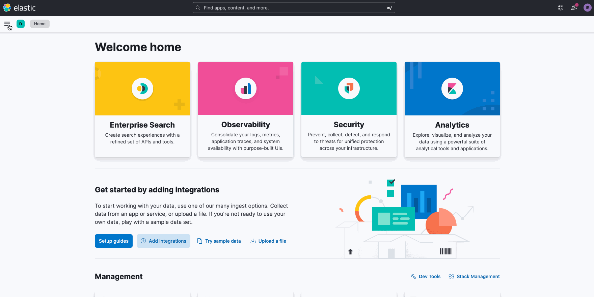
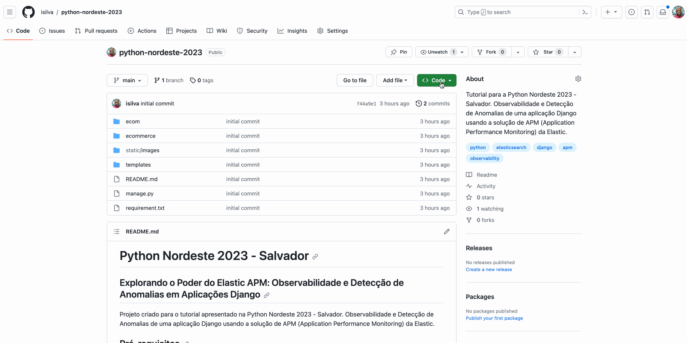
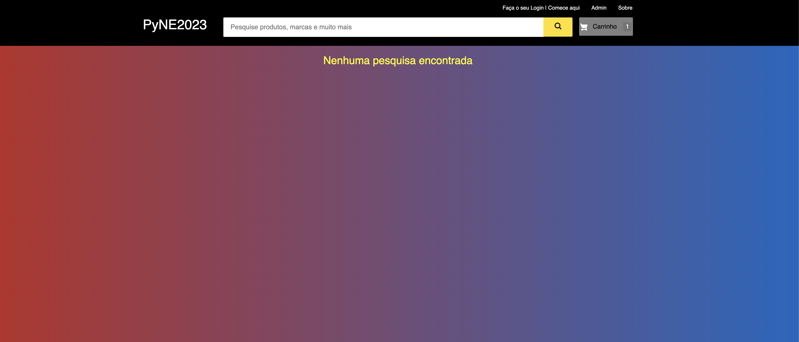

# Python Nordeste 2023 - Salvador

## Explorando o Poder do Elastic APM: Observabilidade e Detecção de Anomalias em Aplicações Django

Projeto criado para o tutorial apresentado na Python Nordeste 2023 - Salvador. Observabilidade e Detecção de Anomalias de uma aplicação Django usando a solução de APM (Application Performance Monitoring) da Elastic.

## Pré-requisitos

1. Python 3.11.5 ou superior.

2. Uma [conta no Elastic Cloud](https://cloud.elastic.co/). Período gratuito de 14 dias sem necessidade de cartão de crédito.

3. Criar um cluster elasticsearch com pelo menos uma instancia de Integration Server.

4. Acesse o Kibana. Copie e guarde a URL do APM Server e o Token. Será usado na configuração do agent APM.



## Como executar este projeto

### Preparação

1. Crie o diretório `tutorial-pyne23`
2. Entre no diretório `tutorial-pyne23`
3. Crie um ambiente python virtual de forma a isolar os pacotes do projeto.

```shel
python3 -m venv .venv
```

4. Ainda dentro do diretório `tutorial-pyne23`, clone o repositório do projeto ou faça download do projeto com a opção `Download ZIP`.

Clonando o projeto.

```shell
git clone https://github.com/isilva/python-nordeste-2023.git
```

Fazendo download do Projeto ZIP.



Caso escolha a opção de download lembre-se de extrair o ZIP dentro do diretório `tutorial-pyne23`.

### Instalação das dependências

1. Ative o ambiente virtual Python. Você deve estar dentro do diretório `tutorial-pyne23`.

```shell
source .venv/bin/activate
```

2. Entre no diretório do projeto `python-nordeste-2023` e instale as dependências.

```shell
pip3 install -r requirement.txt
```

### Configuração agente Elastic APM (Backend)

1. Edite o arquivo `ecommerce/settings.py`.

2. Na sessão `ELASTIC_APM` iremos definir os parametros do agente elastic APM para a integração com o APM da Elastic. Procure por `<<SECRET_TOKEN>>` e `<<URL_APM_COM_PORTA>>` e substitua pelos valores coletados previamente no seu deployment na cloud. Consulte a [documentação](https://www.elastic.co/guide/en/apm/agent/python/current/django-support.html#django-support) para todos os detalhes da configuração.

### Configuração agente Elastic APM (Frontend)

1. Edite o arquivo `templates/ecom/homebase.html`

2. Na tag `scrip` busque por `<<URL_APM_COM_PORTA>>` e substitua pelos valores coletados previamente no seu deployment  na cloud. Consulte a [documentação](https://www.elastic.co/guide/en/apm/agent/rum-js/5.x/install-the-agent.html#install-the-agent) para todos os detalhes da configuração.

### Iniciando a aplicação Django

1. Crie as tabelas da aplicação Django.

```shell
python3 manage.py makemigrations
python3 manage.py migrate
```

2. Crie o usuário admin da aplicação Django.

```shell
python3 manage.py createsuperuser
```

3. Inicialize a aplicação Django.

```shell
python3 manage.py runserver
```

4. Acesse a aplicação em `http://127.0.0.1:8000`

